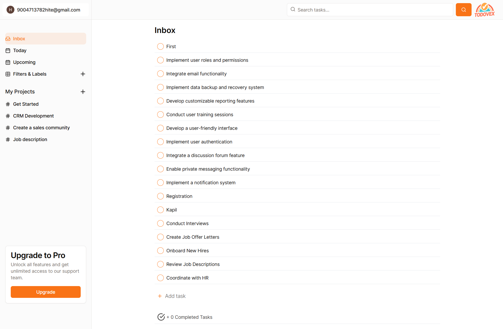

# 📝 TodoVex – AI-Powered Task Management App

**TodoVex** is an open-source, AI-enhanced task management application that streamlines your productivity by intelligently organizing tasks, providing advanced search capabilities, and offering personalized task recommendations.

🔗 **Live Demo:** [https://todovex.vercel.app](https://todovex.vercel.app)

---

## 🚀 Features

- **AI-Powered Task Recommendations:** Leverages OpenAI to suggest relevant tasks and subtasks based on your activity.
- **Vector Search:** Utilizes semantic search to help you find tasks quickly and efficiently.
- **Real-Time Updates:** Powered by Convex, ensuring your task list is always up-to-date.
- **Modern UI Components:** Built with ShadCN UI and Tailwind CSS for a sleek and responsive design.
- **Secure Authentication:** Implements OAuth via Auth.js for secure user login.
- **Project and Label Management:** Organize tasks into projects and labels for better categorization.
- **Mobile Responsive:** Fully responsive design for seamless use on any device.

---

## 🛠️ Tech Stack

**Frontend:**

- Next.js 14 (App Router)
- TypeScript
- Tailwind CSS
- ShadCN UI([GitHub][5], [upde.jp][4])

**Backend & Services:**

- Convex (Real-Time Database)
- OpenAI API (Vector Search & Recommendations)
- Auth.js (OAuth Authentication)

**Deployment:**

- Hosted on Vercel

---

## 📸 Screenshots

### Home


### Dashboard



---

## 🧰 Getting Started

### Prerequisites

- Node.js (v18 or higher)
- npm or yarn
- Convex account
- OpenAI API key
- Google OAuth credentials

### Installation

1. **Clone the repository:**

   ```bash
   git clone https://github.com/Hitesh-s0lanki/todovex.git
   cd todovex
   ```

2. **Install dependencies:**

   ```bash
   npm install
   # or
   yarn install
   ```

3. **Set up environment variables:**

   - Create a `.env.local` file in the root directory.
   - Refer to `.env.example` for the required environment variables.([GitHub][5])

4. **Run the development server:**

   ```bash
   npm run dev
   # or
   yarn dev
   ```

   Open [http://localhost:3000](http://localhost:3000) with your browser to see the result.

---

## ☁️ Deployment

TodoVex is deployed on [Vercel](https://vercel.com), which offers seamless integration with GitHub for continuous deployment. Every push to the `main` branch triggers an automatic deployment.

---

## 🔮 Future Enhancements

- **Calendar Integration:** Sync tasks with Google Calendar for better scheduling.
- **Team Collaboration:** Enable task sharing and collaboration among team members.
- **Enhanced Analytics:** Provide insights into task completion rates and productivity trends.
- **Voice Commands:** Add tasks and navigate the app using voice commands.([Reddit][1], [Toolify][10])

---

## 🤝 Contributing

Contributions are welcome! Please fork the repository and submit a pull request for any enhancements or bug fixes. For major changes, please open an issue first to discuss what you would like to change.

---
